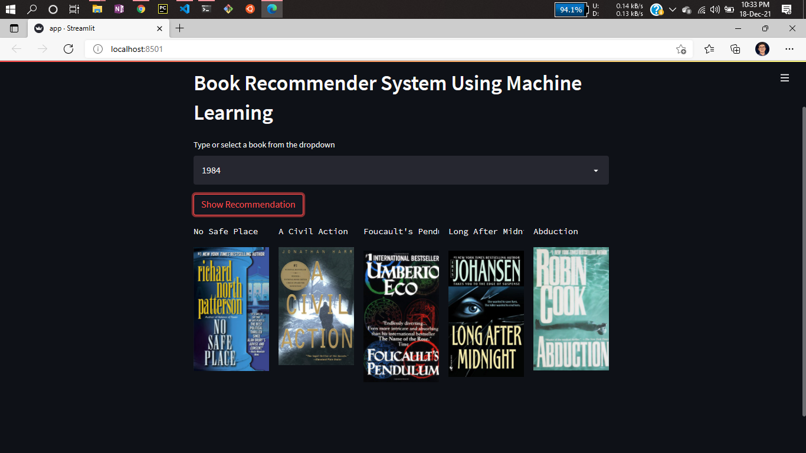
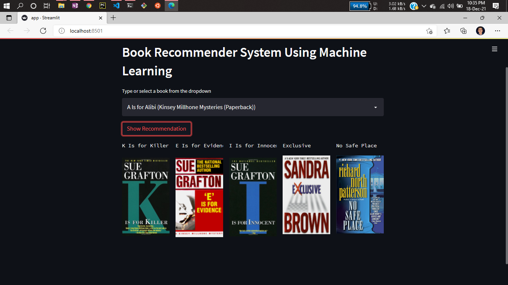
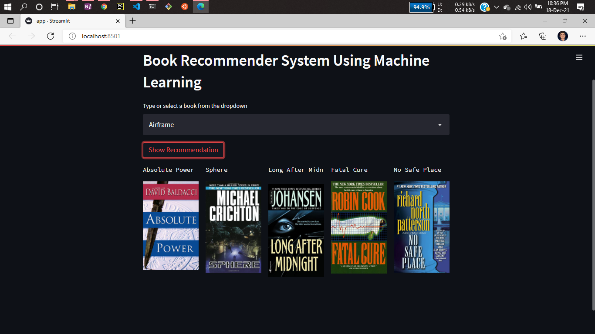

# Project: Book Recommender System Using Machine Learning! | Collaborative Filtering Based


Recommendation systems are becoming increasingly important in today’s extremely busy world. People are always short on time with the myriad tasks they need to accomplish in the limited 24 hours. Therefore, the recommendation systems are important as they help them make the right choices, without having to expend their cognitive resources.

The purpose of a recommendation system basically is to search for content that would be interesting to an individual. Moreover, it involves a number of factors to create personalised lists of useful and interesting content specific to each user/individual. Recommendation systems are Artificial Intelligence based algorithms that skim through all possible options and create a customized list of items that are interesting and relevant to an individual. These results are based on their profile, search/browsing history, what other people with similar traits/demographics are watching, and how likely are you to watch those movies. This is achieved through predictive modeling and heuristics with the data available.

# About this project:

This is a streamlit web application that can recommend various kinds of similar books based on an user interest.
here is a demo,

* [Click here to run it live on server](https://book-recommendation45.herokuapp.com/)


# Demo:








# Dataset has been used:

* [Dataset link](https://www.kaggle.com/ra4u12/bookrecommendation)


# How to run?
### STEPS:

Clone the repository

```bash
https://github.com/entbappy/Books-Recommender-System-Using-Machine-Learning
```
### STEP 01- Create a conda environment after opening the repository

```bash
conda create -n books python=3.7.10 -y
```

```bash
conda activate books
```


### STEP 02- install the requirements
```bash
pip install -r requirements.txt
```


```bash
#run this file to generate the models

Books Recommender.ipynb
```

Now run,
```bash
streamlit run app.py
```


```bash
Author: Bappy Ahmed
Data Scientist
Email: entbappy73@gmail.com

```


